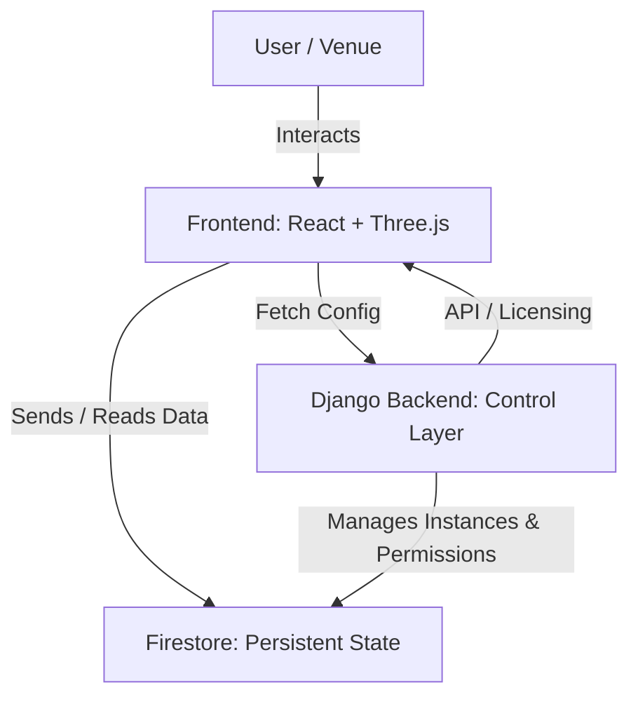
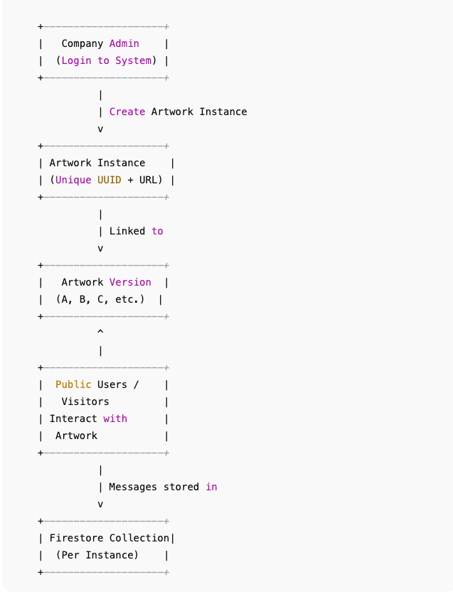

# Messages to the Future / Interactive Art Engine

A modern, multi-tenant interactive web platform for submitting and displaying messages in immersive digital environments. The system combines **persistent state**, **3D interactive experiences**, and **venue-level licensing** to transform public screens into shared cultural memory spaces.

**Live Demo:** [Wireframe Page](https://msg-nu-ashen.vercel.app/wireframe.html)

---

## Table of Contents

* [Project Overview](#project-overview)
* [Conceptual Framework](#conceptual-framework)
* [System Architecture](#system-architecture)
* [Core Models](#core-models)
* [Wireframe Design](#wireframe-design)
* [Color Palette & Typography](#color-palette--typography)
* [Responsive Breakpoints](#responsive-breakpoints)
* [Components & Layout Map](#components--layout-map)
* [Tech Stack](#tech-stack)
* [Getting Started](#getting-started)
* [Testing](#testing)
* [Future Enhancements](#future-enhancements)
* [Author](#author)

---

## Project Overview

**Messages to the Future** / **Interactive Art Engine** enables:

* **Persistent Interactive Artworks** – 3D experiences with isolated instances per venue.
* **Licensing & Orchestration** – Controlled deployment and versioning per venue.
* **Front-End Interactivity** – React + Three.js rendering with live user submissions.
* **Data & Analytics (Future)** – Participation and engagement tracking.
* **Multi-Tenant Architecture (Future)** – Separate instances, permissions, and business logic per venue.

---

## Conceptual Framework

### Philosophical Purpose

* Transform public screens into **shared memory experiences**
* Support **collective authorship**, reflection, and engagement
* Encourage **time-based participation** over passive consumption

### Product Purpose

**MVP Functionality**

* License an artwork
* Generate isolated **ArtworkInstance**
* Apply version-specific logic and moderation
* Deploy artwork to venue screens

**Future Functionality**

* Engagement analytics dashboards
* Multi-artwork licensing
* AI-assisted moderation and reporting

---

## System Architecture

### Layered Structure

* **Control Layer (Django)** – Authentication, licensing, multi-tenant orchestration
* **Memory Layer (Firestore)** – Persistent state per instance, real-time updates
* **Experience Layer (React + Three.js)** – 3D rendering, user interactions, versioned logic

### Mermaid Diagram



*Shows the flow from user actions → 3D frontend → persistent Firestore state → Django orchestration layer.*

---

## Core Models

* **Company** – Licensed venue
* **Artwork** – Master template for interactive experiences
* **Version** – Defines logic, rules, moderation
* **ArtworkInstance** – Isolated deployment per venue
* **License** – Start/end dates and status

---

## Wireframe Design

### 1. Default Canvas View


*3D tunnel, Message cells, top-right control panel visible.*

### 2. Input Modal


*Click a cell to input a message, submit or cancel.*

### 3. Expanded Message


*Overlay for viewing longer messages.*

---

## Color Palette & Typography

| Purpose    | Color       | Hex     |
| ---------- | ----------- | ------- |
| Background | Dark Grey   | #1a1a1a |
| Canvas     | Darker Grey | #0d0d0d |
| Text       | Light Grey  | #e0e0e0 |
| Highlights | Medium Grey | #555555 |
| Controls   | Soft Grey   | #333333 |

**Typography:** `system-ui, sans-serif` — headings bold, body 0.9rem

---

## Responsive Breakpoints

| Device  | Width      | Notes             |
| ------- | ---------- | ----------------- |
| Mobile  | 0–600px    | Stacked layout    |
| Tablet  | 601–1024px | Horizontal panels |
| Desktop | 1025+px    | Full 3D canvas    |

---

## Components & Layout Map

| Component                | Description                        |
| ------------------------ | ---------------------------------- |
| Title Overlay            | Hero / intro title                 |
| Canvas Full              | 3D tunnel, wall cells, MapControls |
| Top-Right Controls       | Reset camera, toggle day/night     |
| Contributions Panel      | Shows submitted messages           |
| Input Modal              | Cell click → input modal           |
| Expanded Message Overlay | Fullscreen message view            |
| Close Button             | Closes overlay                     |

---

## Tech Stack

* Django – Backend orchestration & multi-tenant logic
* Firestore – Persistent state & real-time updates
* React + Three.js – 3D interactive frontend
* Bootstrap 5 – Responsive UI
* JS / TS – Frontend logic

---

## Getting Started

### Prerequisites

* Python 3.11+
* Node.js 18+
* Firebase project for Firestore
* Modern browser

### Setup

```bash
git clone https://github.com/terencereilly/interactive-art-engine.git
cd interactive-art-engine
```

**Backend**

```bash
cd backend
pip install -r requirements.txt
python manage.py migrate
python manage.py runserver
```

**Frontend**

```bash
cd ../frontend
npm install
npm start
```

Configure `.env` for API keys, database credentials, and environment variables.

---

## Testing

* Django unit tests for models & business logic
* Jest / React testing for frontend components
* Firestore security rules validated in Firebase emulator

---

## Future Enhancements

* Multi-artwork licensing Engine
* Engagement analytics dashboard
* AI-assisted moderation
* Multi-language support
* Mobile / kiosk deployment optimization

---

## Author

**Terence Reilly**

* GitHub: [@terencereilly](https://github.com/terencereilly)
* Email: [terryreillyo@gmail.com](mailto:terryreillyo@gmail.com)

---

### What this shows for your MVP:

- **Backend (Django):**  
  - ArtworkInstance model  
  - License & Version metadata  
  - Admin API endpoints for creating/viewing instances  

- **Frontend:**  
  - 3D canvas + message input  
  - Apply version-specific moderation logic  
  - Fetch instance config from Django  

- **Firestore:**  
  - Persistent messages stored per instance `<UUID>`  
  - Each new instance gets its own collection  

- **Out-of-scope / Future:**  
  - Multi-tenant orchestration  
  - AI moderation  
  - Marketplace / multiple artworks  

---

## MVP Architecture: Single-Instance Artwork per Company


This diagram shows how multiple companies can each have **one active artwork instance** with its own **Firestore collection**.



- Each company logs in as an admin
- Generates a unique artwork instance URL
- A Firestore collection is created per instance
- Only **one active instance per company** at a time

