# Interactive Art Engine

An interactive web Art Engine. The system combines **persistent state**, **3D interactive experiences**, and **venue-level licensing** to transform public screens into shared cultural memory spaces.

# Project links

- **App [MVP]** -- [Interactive Art Engine App](https://interactive-art-engine-3b2925832eca.herokuapp.com/)
- **Github Project Board** - https://github.com/users/terencereilly/projects/6

---

## Table of Contents

* [Project Overview](#project-overview)
* [Conceptual Framework](#conceptual-framework)
* [System Architecture](#system-architecture)
* [Core Models](#core-models)
* [Wireframe Design](#wireframe-design)
* [Color Palette & Typography](#color-palette--typography)
* [Responsive Breakpoints](#responsive-breakpoints)
* [Components & Layout Map](#components--layout-map)
* [Tech Stack](#tech-stack)
* [Getting Started](#getting-started)
* [Testing](#testing)
* [Future Enhancements](#future-enhancements)
* [Author](#author)

---

## Project Overview

**Messages to the Future** / **Interactive Art Engine** enables:

* **Persistent Interactive Artworks** – 3D experiences with isolated instances per venue.
* **Licensing & Orchestration** – Controlled deployment and versioning per venue.
* **Front-End Interactivity** – React + Three.js rendering with live user submissions.
* **Data & Analytics (Future)** – Participation and engagement tracking.
* **Multi-Tenant Architecture (Future)** – Separate instances, permissions, and business logic per venue.

---

## Conceptual Framework

### Philosophical Purpose

* Transform public screens into **shared memory experiences**
* Support **collective authorship**, reflection, and engagement
* Encourage **time-based participation** over passive consumption

### Product Purpose

**MVP Functionality**
**ArtworkInstance**

* License an artwork
* Generate isolated 
* Apply version-specific logic and moderation
* Deploy artwork to venue screens

**Future Functionality**

* Engagement analytics dashboards
* Multi-artwork licensing
* AI-assisted moderation and reporting

---

## System Architecture

### Layered Structure

* **Control Layer (Django)** – Authentication, licensing, multi-tenant orchestration
* **Memory Layer (Firestore)** – Persistent state per instance, real-time updates
* **Experience Layer (React + Three.js)** – 3D rendering, user interactions, versioned logic

---

# MVP Version [Completed]

### Landing page with embedded Public [Open] Interactive Artwork


### Users choose which Artwork Version they want
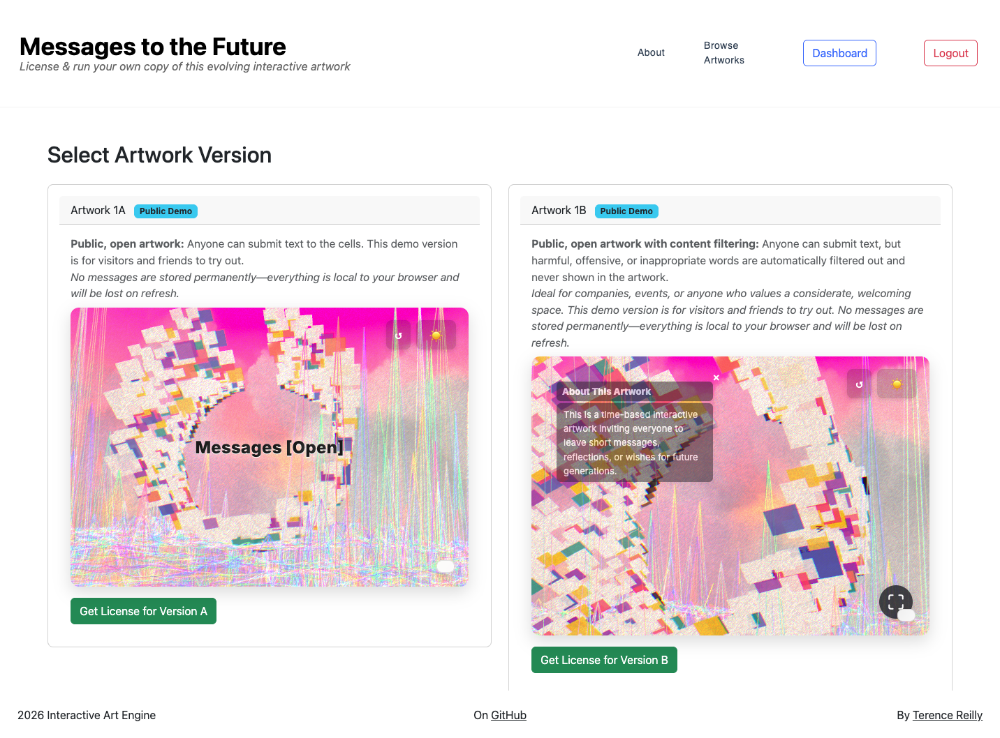

### Artwork Instance View
Displays the main interactive artwork instance as seen by users.
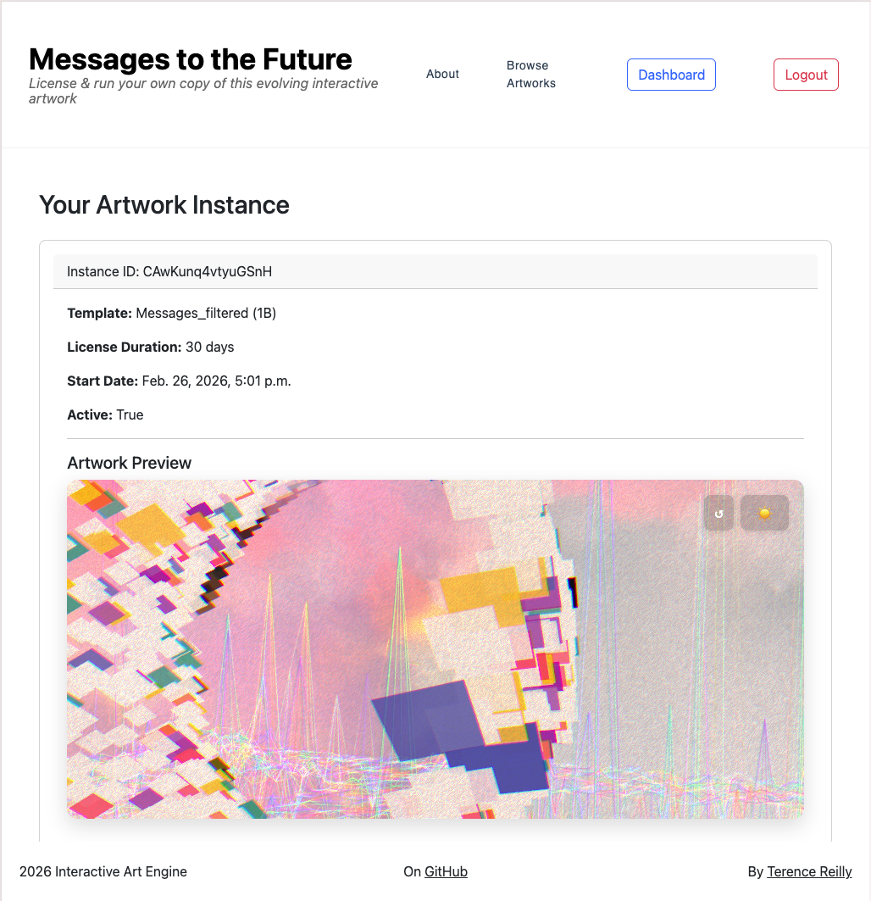

### Login Page
User authentication screen.
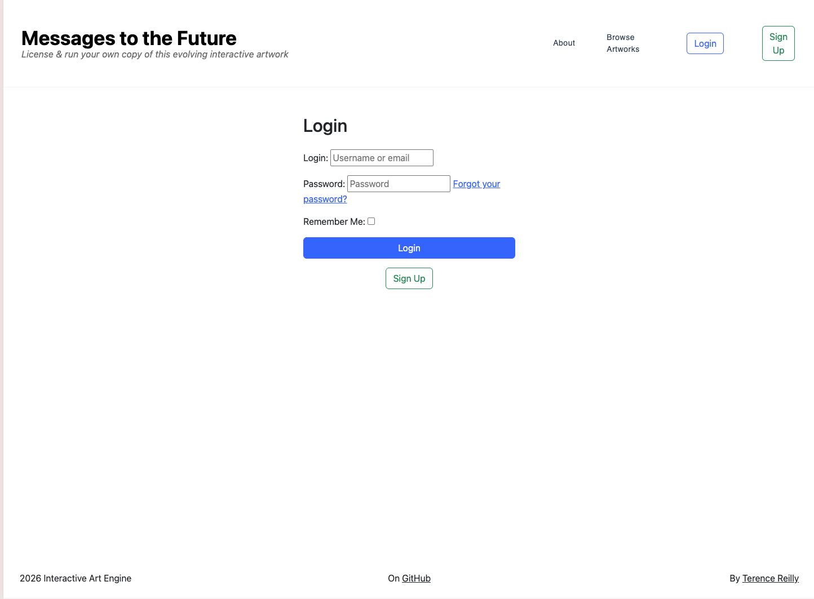

### User Dashboard
Overview of user activity and artwork instances.
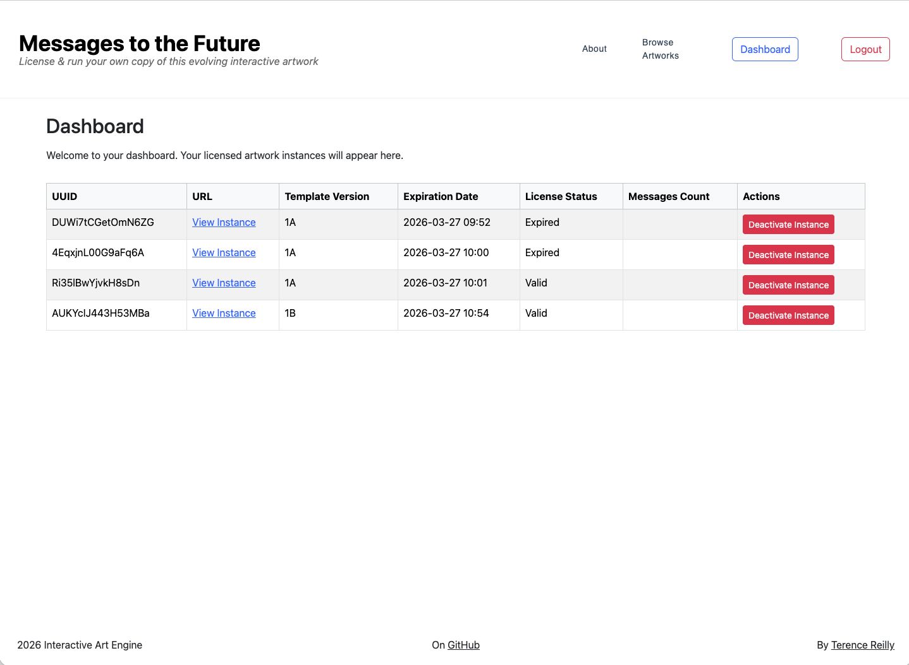

---

## Technical Summary

**Backend:** Django project with apps for artwork templates and licensed instances. Handles user authentication, instance creation, and serves dynamic templates.

**Database:** Uses Firestore for persistent storage of messages per artwork instance, with license-based Firestore rules.

**Frontend:** Artwork UI (React/Three.js) is embedded via iframe; uses FirestoreOlta.js for Firestore integration or browser localStorage for demo mode.

**Integration:** Instance data (license, collection ID, etc.) is passed from Django to the frontend via template-injected JavaScript.

**Security:** Firestore rules enforce write access only for valid, active licenses; demo mode never writes to Firestore.

**Deployment:** Frontend Interactive artworks are hosted on Vercel; backend runs locally and on Heroku.

### Mermaid Diagram

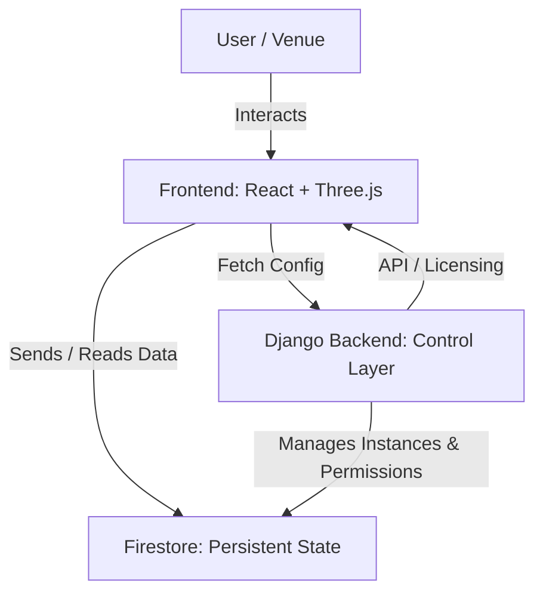

*Shows the flow from user actions → 3D frontend → persistent Firestore state → Django orchestration layer.*

---

# Wireframe Design
Below are the wireframe design for both the 

- The Interactive Art Engine
- The persistent state interactive Artwork 

## The Interactive Art Engine [The System]

+------------------------------------------------------+
| Interactive Art Engine                               |
|------------------------------------------------------|
| [Title]         [About] [Dashboard] [Login/Register] |
+------------------------------------------------------+
| Nav:                                                 |
| - Title: "Messages to the Future"                    |
| - Subtitle: "License & run your own copy of this     |
| - evolving interactive artwork                       |
| - About [Artwork + Artist]                           |
| - About [Artwork + Artist]                           |
+------------------------------------------------------+
| Browse Artwork Versions:                             |
| - Artwork Instance [A, B ...]                        |
| - Artwork image/preview [iframe with local storage]  |
| - Get Instance [Own your own License]                |
| - View Details / Edit                                |
+------------------------------------------------------+
| Dashboard:                                           |
| - User info                                          |
| - List of users Artwork Instances + ID's             |
| - License Start + End Dates                          |
| - End License Anytime [Deactivate License]           |
| - Analytics summary [Number of Interactions]         |
+------------------------------------------------------+
| Responsive Layout:                                   |
| - Mobile: Stacked panels, hamburger menu             |
| - Tablet: Horizontal panels, collapsible sidebar     |
| - Desktop: Full 3D canvas                            |
+------------------------------------------------------+
| Footer:                                              |
| - Links: About, Contact, GitHub                      |
+------------------------------------------------------+

## Wireframe Design for the interactive artwork [The Product]
Here is the core user shared interaction 

### User Input Message (Desktop)
Panel selection in the 3D scene triggers a modal for text submission.
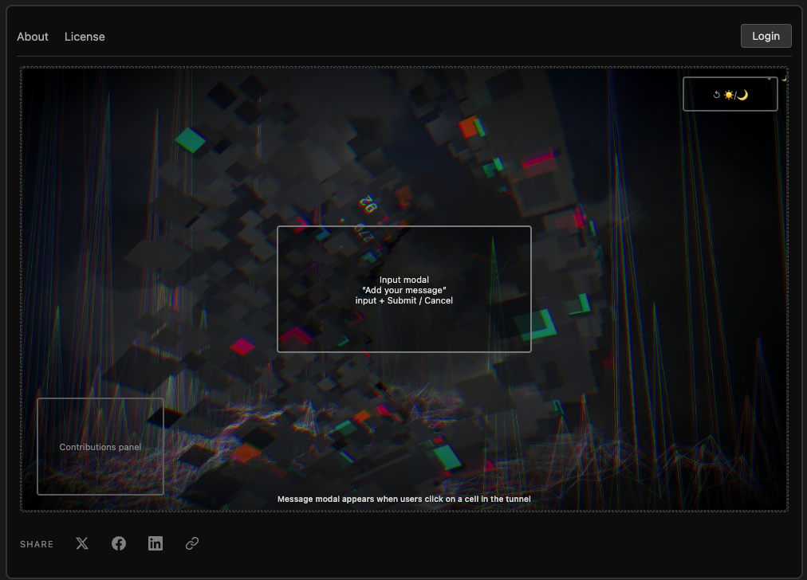

### Learn More (Desktop)
Expanding a panel reveals more about the message and the user.
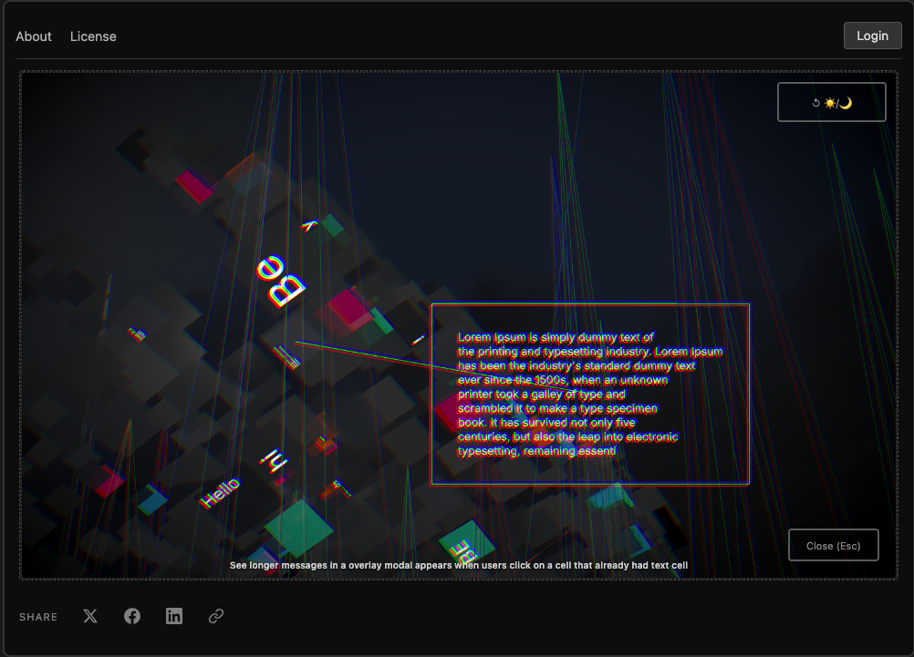

---                     

## Core Features

1. **Licensing & Orchestration**  
   - Controlled deployment and versioning for each user
   - License management for artwork instances.
   - Each users get's their own unique interactive artwork instance. [Which has persistent state built into it]

2. **Admin Dashboard**  
   - User authentication and management.
   - Overview of artwork instances and license status.

3. **Artworks that remember everyone's interactions**  
   - React + Three.js for immersive 3D rendering and user interaction.
   - Real-time user contributions to collective Artwork
   - User messages are stored persistently using Firestore database [Already integrated in MVP stage] & soon in the future via Arweave Protocol [Link Text](https://arweave.org/)

4. **Multi-Tenant Architecture (Planned/Future)**  
   - Permissions, and business logic per venue.

5. **Data & Analytics (Planned/Future)**  
   - Participation and engagement tracking.

6. **Responsive Interaction Design & user device detection**  
   - Optimized layouts, design hook & interaction UX for desktop, tablet, and mobile devices. [Making the experience suitable for dfferent user devices and larger screens.]

7. **Security**  
   - Django checks Firestore rules for user access to update / evolve the interactive artworks.
   - Django authentication for users and admins.

--- 

# Django [Backend]

**Django handles:**
- Authentication
- Instance creation
- License enforcement

- **Artwork Templates** = master blueprint artworks (A, B ...)
- **Artwork Instance** = licensed, isolated copy of artwork (A or B ...)

## Core Models

* **User** – Venue, Event, Organisation, Person
* **Artwork** – Master template for interactive experiences
* **Artwork Version** – Defines logic, rules, moderation
* **ArtworkInstance** – Isolated deployment per venue
* **License** – Start/end dates and Ownership status

---

## Django Relationship Database Design

- **User**: Each user can create 1 artwork instance of each artwork version.
- **ArtworkTemplate**: Defines a version/type of artwork (e.g., “Artwork 1A”).
- **ArtworkInstance**: Represents a user’s licensed copy of an artwork.  
  - Each instance is linked to one user and one artwork template.
  - Each instance has a unique Firestore collection for its messages.
- **Relationships**:
  - `ArtworkInstance` has a foreign key to `User` (many-to-one).
  - `ArtworkInstance` has a foreign key to `ArtworkTemplate` (many-to-one).

## Django Database Table Design

### 1. User (Django’s built-in auth_user)

| Field         | Description                |
|-------------- |---------------------------|
| id (PK)       | Primary key               |
| username      | Username                  |
| email         | Email address             |
| password      | Hashed password           |
| date_joined   | Account creation date     |

### 2. ArtworkTemplate

Represents a version/type of artwork (e.g., “Artwork 1A”).

| Field         | Description                        |
|-------------- |-----------------------------------|
| id (PK)       | Primary key                       |
| name          | Artwork name                      |
| version_code  | Version code (e.g., v1a)          |
| description   | Description                       |
| created_at    | Creation timestamp                |
| is_active     | Is template active?               |


One template can have many user instances.

### 3. ArtworkInstance

Represents a licensed copy owned by a specific user.

| Field                      | Description                                 |
|--------------------------- |--------------------------------------------|
| id (PK)                    | Primary key                                |
| user_id (FK → User.id)     | Foreign key to User                        |
| artwork_template_id (FK)   | Foreign key to ArtworkTemplate             |
| firestore_collection_name  | Unique Firestore collection for messages   |
| license_start_date         | License start date                         |
| license_end_date           | License end date                           |
| is_active                  | Is license active?                         |
| created_at                 | Instance creation timestamp                |


### Relationship Diagram

```
User
  └── 1 ────────────────┐
                         │
                    ArtworkInstance
                         │
  ArtworkTemplate ── 1 ──┘
```


### Important Constraint (The Business Rule)

- An Artwork Template can generate many Artwork Instances.
- Each user can create only **1 Artwork Instance of each Artwork Template**.

Here's how the unique constraint is implemented In Django:

`UNIQUE (user_id, artwork_template_id)`

```python
class Meta:
    constraints = [
        models.UniqueConstraint(
            fields=['user', 'artwork_template'],
            name='unique_user_template_instance'
        )
    ]
```

---

# Firestore

- **firestore_collection_name** = unique persistent message store
Users license Artwork instances; each instance is based on a template and stores its messages in a unique Firestore collection.

### Licensing Validation Proof
Screen showing license validation for venues.
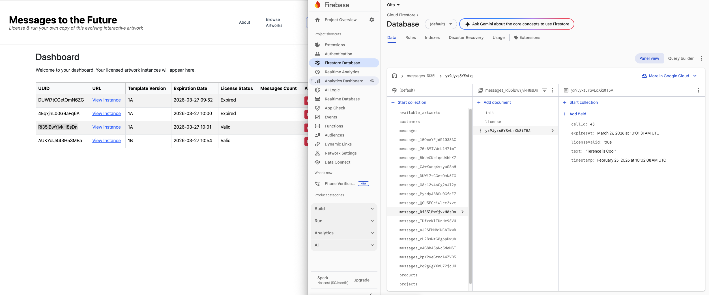

---

# Design

## Color Palette & Typography

| Purpose    | Color       | Hex     |
| ---------- | ----------- | ------- |
| Background | Dark Grey   | #1a1a1a |
| Canvas     | Darker Grey | #0d0d0d |
| Text       | Light Grey  | #e0e0e0 |
| Highlights | Medium Grey | #555555 |
| Controls   | Soft Grey   | #333333 |

**Typography:** `system-ui, sans-serif` — headings bold, body 0.9rem

---

# Responsive Breakpoints

| Device  | Width       | Notes             |
| ------- | ----------  | ----------------- |
| Mobile  | 0–425px     | Stacked layout    |
| Tablet  | 768–1024px  | Horizontal panels |
| Desktop | 1024-2560px | Full 3D canvas    |

# Screenshots of Responsive Breakpoints
Wireframes showing the app at various screen widths:

<table>
  <tr>
    <td align="center">
      <b>On mobile phone devices - width 425px:</b><br>
      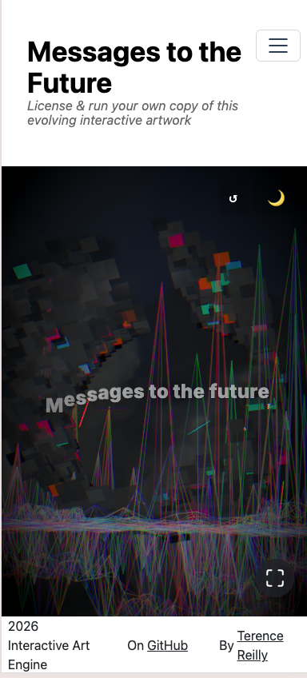
    </td>
    <td align="center">
      <b>On bigger mobile phone devices - Min width 768px:</b><br>
      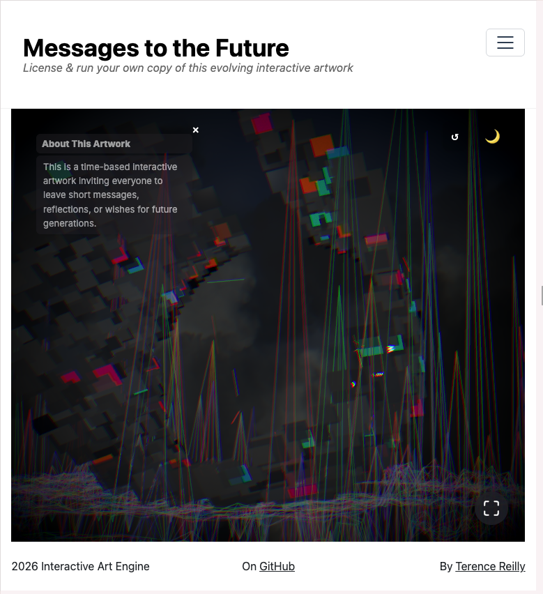
    </td>
  </tr>
</table>

 **On laptops / Desktop Computers - Min width 1024px:**
  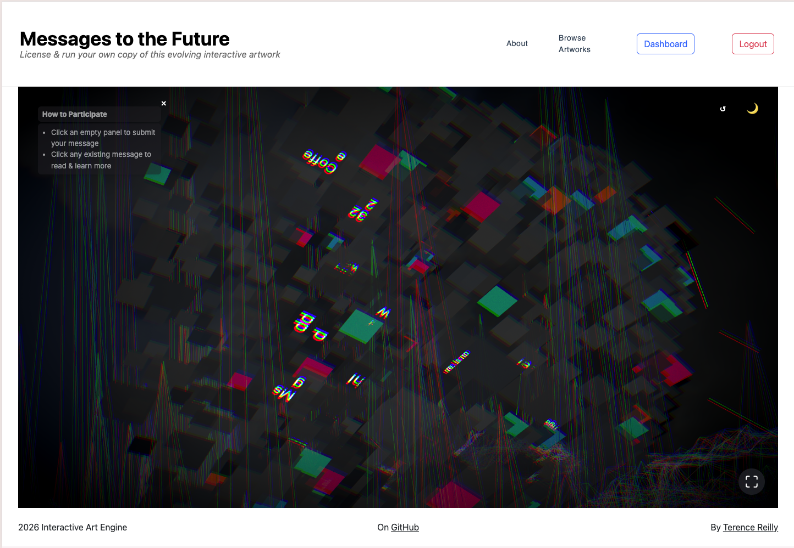

 **On large Desktop Computers / TV screens / Projectors - Min width 2560px:**
  

---

## Components & Layout Map

| Component                | Description                        |
| ------------------------ | ---------------------------------- |
| Title Overlay            | Intro title to help onboarding     |
| Canvas Full              | 3D tunnel, wall cells, MapControls |
| Top-Right Controls       | Reset camera, toggle day/night     |
| Contributions Panel      | Shows submitted messages           |
| Input Modal              | Cell click → input modal           |
| Expanded Message Overlay | Fullscreen message view            |
| Close Button             | Closes overlay                     |

---

# Testing

## Django Tests

* Django unit tests for models & business logic for licensing 
## Firestore Integration Tests (artworks/tests.py)

## Backend Unit Tests
* This project includes Django unit tests for both model logic and Firestore integration. These tests ensure that your licensing, instance creation, and Firestore message storage all work as expected.

* Example Firestore Integration Tests in Artwork App (tests.py):
## Test 1: Django creates a new Firestore collection and verifies the document

```python
from django.test import TestCase

# FirestoreIntegrationTests
# To create a new collection and one document in Firestore, then read it back and verify the content.
import os
import firebase_admin
from firebase_admin import credentials, firestore
from dotenv import load_dotenv
from django.test import TestCase
```
## Test 2: Django writes and reads a message in Firestore.

```python
class FirestoreIntegrationTest(TestCase):
  @classmethod
  def setUpClass(cls):
    super().setUpClass()
    load_dotenv()
    FIREBASE_CRED_PATH = os.getenv("FIREBASE_CRED_PATH")
    if FIREBASE_CRED_PATH and not firebase_admin._apps:
      cred = credentials.Certificate(FIREBASE_CRED_PATH)
      firebase_admin.initialize_app(cred)
    cls.firestore_client = firestore.client()
   
  def test_create_new_collection(self):
    # Create a new collection and add a document
    new_collection = "new_test_collection"
    doc_id = "first_doc"
    doc_ref = self.firestore_client.collection(new_collection).document(doc_id)
    doc_data = {"message": "This is a new collection!", "user": "tester"}
    doc_ref.set(doc_data)

    # Read the document back
    doc = doc_ref.get()
    data = doc.to_dict()
    self.assertIsNotNone(data)
    self.assertEqual(data["message"], "This is a new collection!")
    self.assertEqual(data["user"], "tester")

  def test_firestore_write_and_read(self):
    doc_ref = self.firestore_client.collection("test_collection").document("test_doc")
    test_message = "Hello Terence from Django TestCase!"
    doc_ref.set({"message": test_message})
    doc = doc_ref.get()
    data = doc.to_dict()
    self.assertIsNotNone(data)
    self.assertEqual(data.get("message"), test_message)
  ```
  ## Test 3: Django simulates a second user adding a message to the same collection.
```python
  def test_firestore_second_user_message(self):
    # Ensure the first message exists
    doc_ref1 = self.firestore_client.collection("test_collection").document("test_doc")
    doc_ref1.set({"message": "Hello Terence from Django TestCase!"})

    # Add a second message as another user
    doc_ref2 = self.firestore_client.collection("test_collection").document("test_doc_2")
    second_message = "Hello from a second user!"
    doc_ref2.set({"message": second_message, "user": "user2"})

    # Read all messages in the collection
    docs = list(self.firestore_client.collection("test_collection").stream())
    messages = {doc.id: doc.to_dict() for doc in docs}

    self.assertIn("test_doc", messages)
    self.assertIn("test_doc_2", messages)
    self.assertEqual(messages["test_doc_2"]["message"], second_message)
    self.assertEqual(messages["test_doc_2"]["user"], "user2")
```

## Performance Testing
### Lighthouse Test Results
Performance and accessibility test results for the app.
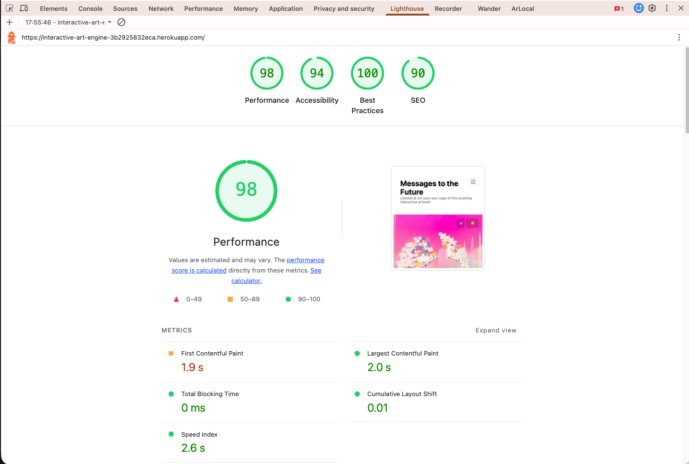

## How to Get started with Development

### Prerequisites

* Python 3.11+
* Node.js 18+
* Firebase project for Firestore
* Modern browser

### Setup

```bash
git clone https://github.com/terencereilly/interactive-art-engine.git
cd interactive-art-engine
```

**Backend**

```bash
cd backend
pip install -r requirements.txt
python manage.py migrate
python manage.py runserver
```

**Frontend**

```bash
cd ../frontend
npm install
npm start
```

Configure `.env` for API keys, database credentials, and environment variables.

---

## Future Enhancements

* Multi-artwork licensing Engine
* Payment System [Stripe]
* Engagement analytics dashboard
* AI-assisted moderation
* Multi-language support
* Mobile deployment optimization

---

# Author

**Terence Reilly**

* GitHub: [@terencereilly](https://github.com/terencereilly)
* Email: [terryreillyo@gmail.com](mailto:terryreillyo@gmail.com)

---